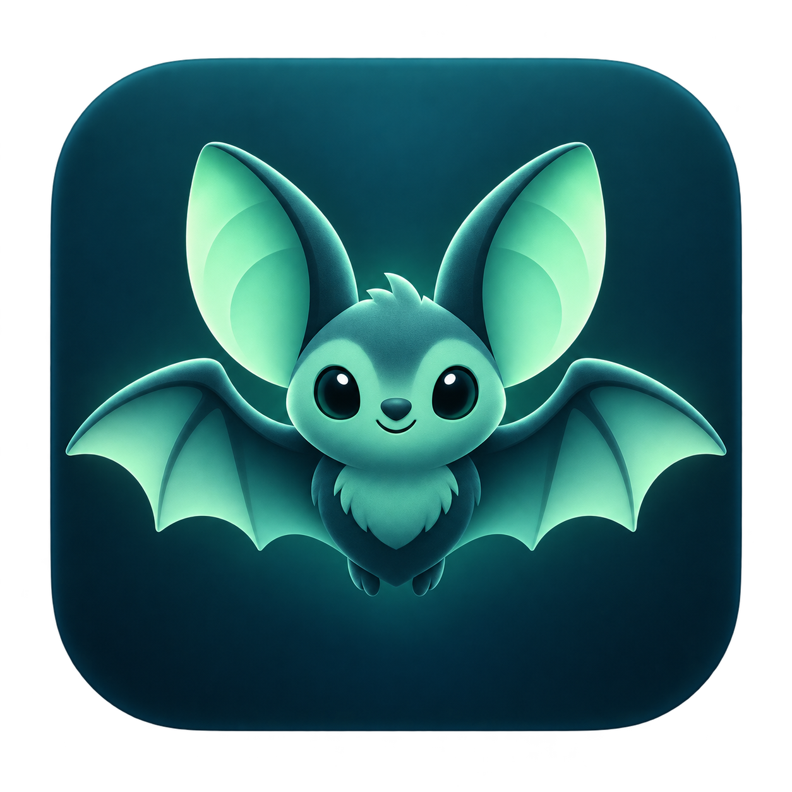

# Sonar



An experimental native macOS app that uses near-ultrasonic sound and Doppler motion detection to scroll other applications. Two quick air taps reverse scrolling direction.

## Build

Requires macOS 13 or later and Apple's Xcode Command Line Tools. No third-party dependencies.

```sh
bash build.sh
open build/Sonar.app
```

The build targets the Mac's current architecture. It is ad-hoc signed for local use, not notarized for distribution.

## Use

1. Use built-in speakers and microphone at low volume, without headphones.
2. Click **Start sonar**, grant microphone access, and keep still during the three-second calibration.
3. Enable **Scroll other apps** and allow Sonar in System Settings → Privacy & Security → Accessibility. Enable the switch again after granting access.
4. Place the pointer over a scrollable window, including a page in Brave. Move a hand toward or away from your Mac to scroll.
5. Make two quick air taps to reverse direction, or press **Reverse direction**.

Adjust sensitivity and scroll speed as needed. Recalibrate after changing volume or your setup. Stop from the menu bar; Command-period also stops sensing while Sonar is focused. Closing the window leaves the menu bar control running; Quit stops everything.

## How it works

Sonar emits a 19–21 kHz carrier and analyzes nearby frequency energy using a Hann window and Goertzel analysis. It uses 4096-sample windows with 512-sample overlapping steps, calibrated background subtraction, hysteresis, an 80 ms scroll dwell, and time-scaled scrolling. Default speed is 30 with a range of 3–90. Brief motion pairs reverse direction; they may also scroll slightly.

This detects movement, not absolute hand placement or distance. Results depend on speakers, microphone, device buffering and room acoustics. High-frequency audio is not guaranteed inaudible to people or animals. Audio stays on the Mac and is never saved or transmitted.

## Validation

```sh
bash test.sh
```

Synthetic checks cover frequency shifts, silence, weak reflections, agreement with a reference DFT, hysteresis, double taps, cooldown and sustained-motion rejection. Physical tracking and system-wide scrolling require a hardware trial with permissions enabled. Latency is not an end-to-end measured guarantee.

The bat icon was generated with AI; its prompt is in `Logo-design.txt`.
